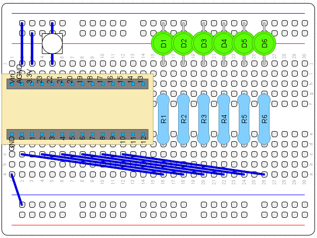

# BinaryCounter
A practice project using a Teensy 3.2 Arduino board

## Project Description
A simple counter using a Teensy 3.2 Arduino board, a button, and LEDs. The LEDs are the display for a counter representing the number in binary. The button increases the counter when pressed.
This project is designed to be simple, with potential to expand.

## Components 

- Teensy 3.2 board
- Breadboard
- 6 LEDs
- 6 x 220 Ohm resistors
- 1 push button
- 2 14-pin sections of male header pins
- Jumper wires

## Project Layout

