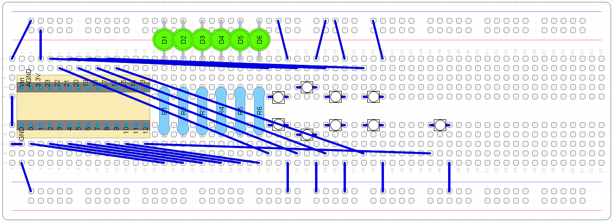
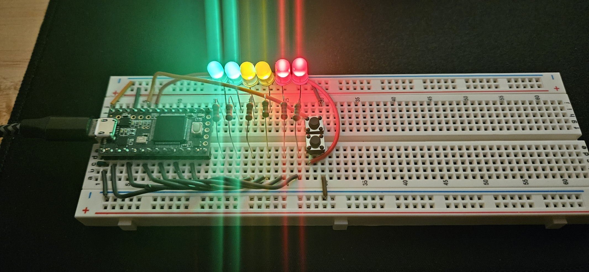

# BinaryCalculator
A practice project using a Teensy 3.2 Arduino board

## Project Description
A simple calculator using a Teensy 3.2 Arduino board, a button, and LEDs. The project is based on the previous project, [BinaryCounter](https://github.com/ChazHanda/BinaryCounter). The LEDs are a display that represents the values 0-63 in binary. 

The first three upper buttons increase the counter by 1, 4, and 16, respectively. 

The first three lower buttons decrease the counter by 1, 4, and 16, respectively. 

The fourth upper button functions similarly to the '+' on a calculator. It will store the current value represented by LEDs and reset them to '0'. The next value input will be added to any existing stored value.

The fourth lower button functions similarly to the '-' on a calculator. It will store the current value represented by LEDs and reset them to '0'. The next value input will be subtracted from any existing stored value.

The fifth lower button functions similarly to the '=' on a calculator. It will attempt to display the stored value. If the stored value is under 0 or above 63, the value will wrap around, and the built-in LED will flash.

Overflow or underflow will flash the built-in LED and wrap around 0 and 63. 

## Components 

- Teensy 3.2 board
- Breadboard
- 6 LEDs
- 6 x 220 Ohm resistors
- 9 push buttons
- 2 14-pin sections of male header pins
- Jumper wires

## Project Layout

## Picture of Project

The counter at the maximum display count (63)

## Code Uploaded to Teensy 3.2

[BinaryCalculator.ino](BinaryCalculator.ino)
